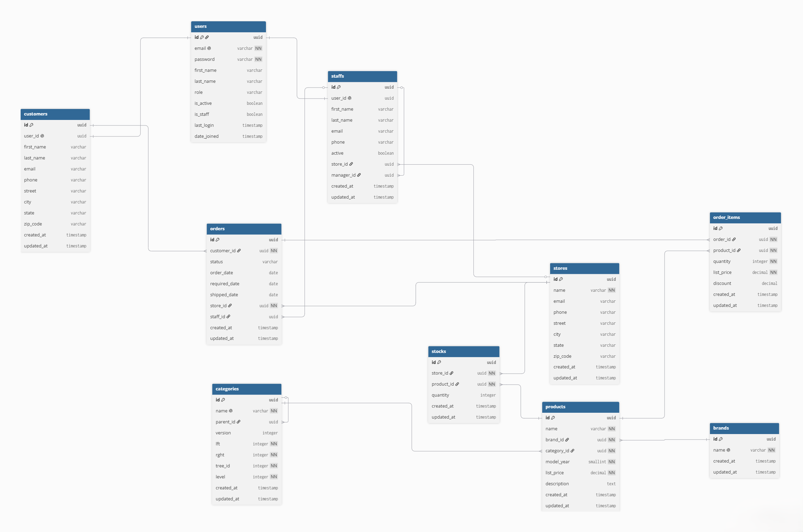
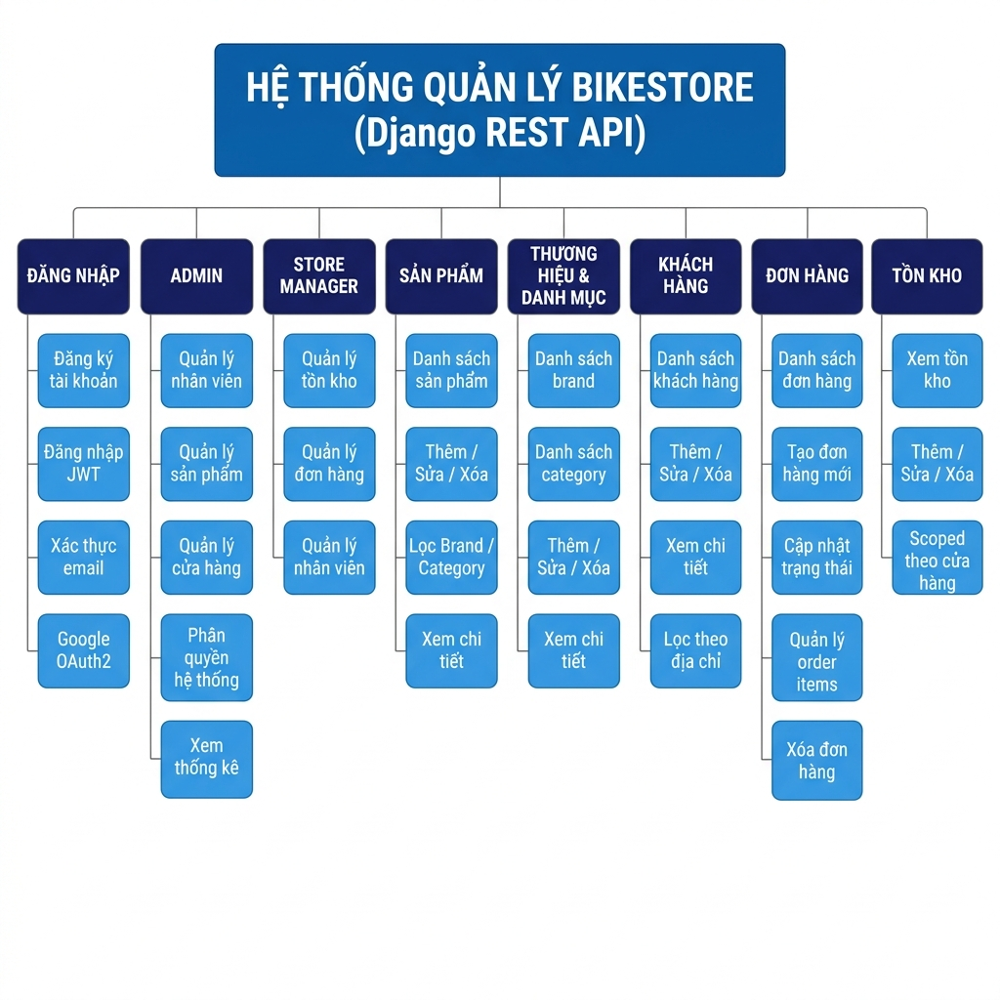
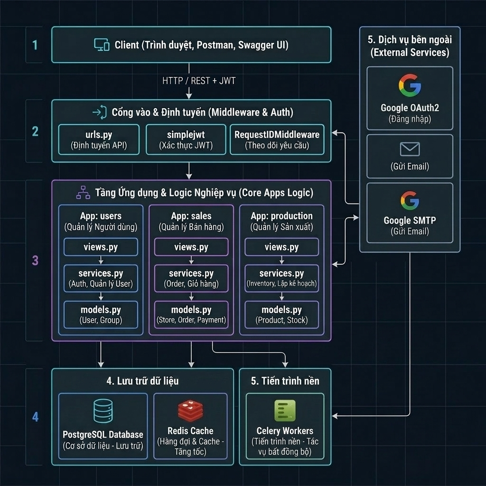

# XÂY DỰNG HỆ THỐNG QUẢN LÝ BÁN XE ĐẠP SỬ DỤNG DJANGO

## Thông tin

**Môn học:** IE221 — Kỹ thuật lập trình Python  
**Nhóm thực hiện:** Nhóm 8993

**Sinh viên thực hiện:**

| STT | Họ tên | MSSV | Ngành |
|-----|--------|------|-------|
| 1 | Cao Trình Thịnh | 23521493 | CNTT |
| 2 | Trần Duy Nhân | 23521089 | CNTT |

---

## Giới thiệu

Đề tài xây dựng hệ thống **Backend API Server** cho cửa hàng xe đạp nhằm triển khai một RESTful API phục vụ quản lý toàn bộ hoạt động kinh doanh — từ quản lý sản phẩm, tồn kho, đơn hàng cho đến phân quyền nhân viên theo cửa hàng và xác thực người dùng qua email/OAuth2.

### Đặc điểm nổi bật

- **Framework:** Django 5 + Django REST Framework
- **API Documentation:** Tự động tài liệu hóa qua Swagger UI & ReDoc (`drf-spectacular` với Sidecar, không cần CDN)
- **Bảo mật:** JWT (`djangorestframework-simplejwt`) + Google OAuth2 (`django-allauth`, `dj-rest-auth`) + Xác thực email bắt buộc
- **Database:** PostgreSQL với Django ORM — Migration tự động qua `manage.py migrate`
- **Cache & Broker:** Redis (cache danh mục, session)
- **Background Tasks:** Celery Worker
- **RBAC:** Phân quyền theo vai trò — `CUSTOMER`, `STAFF`, `STORE_MANAGER`, `ADMIN`
- **Testing:** `pytest-django` + `factory-boy` — **62 test cases**, tất cả pass

> **Lưu ý:** Thiết kế cơ sở dữ liệu được tham khảo từ BikeStores Sample Database, sau đó được chuẩn hóa và tái thiết kế theo Django ORM với UUID primary key, BaseModel (timestamps), và Service Layer Pattern.

---

## Cơ sở dữ liệu

### Sơ đồ quan hệ



### Mô tả các bảng

Hệ thống gồm **10 bảng chính** chia thành 3 domain:

#### Domain: Users (Xác thực & Phân quyền)

| Bảng | Mô tả |
|------|-------|
| `users_user` | Tài khoản hệ thống. Email là tên đăng nhập (không dùng username). Vai trò: `CUSTOMER`, `STAFF`, `STORE_MANAGER`, `ADMIN` |

#### Domain: Sales (Kinh doanh)

| Bảng | Mô tả |
|------|-------|
| `sales_store` | Cửa hàng xe đạp vật lý |
| `sales_customer` | Hồ sơ khách hàng, liên kết 1-1 với User |
| `sales_staff` | Nhân viên tại cửa hàng, có quan hệ tự tham chiếu cho cấp quản lý |
| `sales_order` | Đơn hàng với FSM trạng thái: `pending → processing → completed / rejected` |
| `sales_orderitem` | Chi tiết đơn hàng — snapshot giá và chiết khấu tại thời điểm đặt |

#### Domain: Production (Catalog sản phẩm)

| Bảng | Mô tả |
|------|-------|
| `production_brand` | Thương hiệu xe đạp |
| `production_category` | Danh mục sản phẩm dạng cây phân cấp (django-mptt) |
| `production_product` | Sản phẩm xe đạp |
| `production_stock` | Tồn kho theo từng cửa hàng — ràng buộc unique `(store, product)` |

---

## Chức năng hệ thống



### Xác thực & Quản lý tài khoản

| Endpoint | Phương thức | Mô tả | Quyền |
|----------|-------------|-------|-------|
| `/auth/registration/` | POST | Đăng ký tài khoản mới — gửi email xác thực | Public |
| `/auth/registration/resend-email/` | POST | Gửi lại email xác thực | Public |
| `/auth/registration/verify-email/` | POST | Xác thực email với mã key | Public |
| `/auth/registration/account-confirm-email/<key>/` | GET | Trang xác nhận qua link trong email | Public |
| `/auth/login/` | POST | Đăng nhập — nhận cặp JWT (access + refresh) | Public |
| `/auth/logout/` | POST | Đăng xuất — blacklist refresh token | Authenticated |
| `/auth/token/refresh/` | POST | Làm mới access token | Public |
| `/auth/me/` | GET | Xem thông tin người dùng hiện tại | Authenticated |
| `/auth/google/` | GET | Khởi tạo luồng Google OAuth2 | Public |
| `/auth/google/callback/` | GET | Nhận JWT từ Google OAuth2 | Public |

### Catalog sản phẩm

| Endpoint | Phương thức | Mô tả | Quyền |
|----------|-------------|-------|-------|
| `/api/v1/categories/` | GET | Danh sách danh mục (dạng cây) | Public |
| `/api/v1/categories/` | POST | Thêm danh mục mới | STORE_MANAGER+ |
| `/api/v1/categories/<id>/` | GET/PATCH/DELETE | Chi tiết, cập nhật, xóa danh mục | GET: Public / Others: STORE_MANAGER+ |
| `/api/v1/brands/` | GET/POST | Danh sách & thêm thương hiệu | GET: Public / POST: STORE_MANAGER+ |
| `/api/v1/brands/<id>/` | GET/PATCH/DELETE | Chi tiết, cập nhật, xóa thương hiệu | GET: Public / Others: STORE_MANAGER+ |
| `/api/v1/products/` | GET/POST | Danh sách & thêm sản phẩm | GET: Public / POST: STORE_MANAGER+ |
| `/api/v1/products/<id>/` | GET/PATCH/DELETE | Chi tiết, cập nhật, xóa sản phẩm | GET: Public / Others: STORE_MANAGER+ |
| `/api/v1/stocks/` | GET/POST | Tồn kho — Manager chỉ thấy kho của mình | STORE_MANAGER+ |
| `/api/v1/stocks/<id>/` | PATCH/DELETE | Cập nhật, xóa tồn kho | STORE_MANAGER+ |

### Kinh doanh & Quản lý

| Endpoint | Phương thức | Mô tả | Quyền |
|----------|-------------|-------|-------|
| `/api/v1/stores/` | GET/POST | Danh sách & thêm cửa hàng | GET: STAFF+ / POST: ADMIN |
| `/api/v1/stores/<id>/` | GET/PATCH/DELETE | Chi tiết, cập nhật, xóa cửa hàng | ADMIN |
| `/api/v1/customers/` | GET/POST | Danh sách & thêm khách hàng | STAFF+ |
| `/api/v1/customers/<id>/` | GET/PATCH/DELETE | Chi tiết, cập nhật, xóa khách hàng | STAFF+ |
| `/api/v1/staff/` | GET/POST | Danh sách & thêm nhân viên | STORE_MANAGER+ |
| `/api/v1/staff/<id>/` | GET/PATCH/DELETE | Chi tiết, cập nhật, xóa nhân viên | STORE_MANAGER+ |
| `/api/v1/orders/` | GET/POST | Danh sách & tạo đơn hàng mới | STAFF+ |
| `/api/v1/orders/<id>/` | GET/PATCH | Xem & cập nhật trạng thái đơn hàng | STAFF+ |

### Kiểm tra hệ thống

| Endpoint | Phương thức | Mô tả |
|----------|-------------|-------|
| `/health/` | GET | Health check endpoint |
| `/api/docs/` | GET | Swagger UI (không cần CDN) |
| `/api/redoc/` | GET | ReDoc API documentation |

---

## Kiến trúc hệ thống



### Sơ đồ lớp chức năng


Dự án tuân thủ **Service Layer Pattern** để tách biệt rõ ràng các tầng trách nhiệm:

```
Request → View → Service → Selector → Model → Database
```

| Tầng | File | Trách nhiệm |
|------|------|-------------|
| **View** | `views.py` | Xử lý HTTP request/response. **Không gọi `.objects.` trực tiếp** |
| **Service** | `services.py` | Business logic — tạo đơn hàng, kiểm tra stock, FSM transitions |
| **Selector** | `selectors.py` | Database queries — tất cả truy vấn tập trung tại đây |
| **Model** | `models.py` | Schema, constraints, `BaseModel` (UUID pk, auto timestamps) |

**Nguyên tắc quan trọng:**
- `create_order()` chạy trong atomic transaction, kiểm tra tồn kho trước khi tạo
- Manager chỉ có thể quản lý cửa hàng của mình (store-scoped)
- Xóa sản phẩm bị từ chối nếu đã có order items
- Xóa danh mục bị từ chối nếu có danh mục con

---

## Cài đặt và Chạy

### Yêu cầu hệ thống

- **Python:** 3.11 hoặc mới hơn
- **PostgreSQL:** 14+
- **Redis:** 7+

### Cách 1: Chạy hoàn toàn bằng Docker Compose

#### Bước 1: Sao chép và cấu hình biến môi trường

```powershell
copy .env.example .env
```

Mở file `.env` và điền các giá trị bắt buộc:

```env
SECRET_KEY=django-insecure-thay-bang-key-that-cua-ban
DB_PASSWORD=mat_khau_postgresql
DJANGO_SETTINGS_MODULE=config.settings.dev
```

#### Bước 2: Khởi động toàn bộ stack

```powershell
docker compose up --build
```

API sẽ khả dụng tại:

| URL | Mô tả |
|-----|-------|
| `http://localhost:8000/health/` | Health check |
| `http://localhost:8000/api/docs/` | Swagger UI |
| `http://localhost:8000/api/v1/products/` | Danh sách sản phẩm |
| `http://localhost:8000/api/v1/orders/` | Danh sách đơn hàng |

#### Bước 3 (tùy chọn): Seed dữ liệu mẫu

```powershell
docker compose exec web python manage.py seed_db --clean
```

---

### Cách 2: Chạy Django trên host, DB/Redis trong Docker

Phù hợp cho việc phát triển và debug trực tiếp trên máy.

#### Bước 1: Khởi động chỉ PostgreSQL và Redis

```powershell
docker compose up db redis -d
```

#### Bước 2: Cài đặt dependencies

```powershell
python -m pip install -e ".[dev]"
```

#### Bước 3: Migrate database và chạy server

```powershell
python manage.py migrate
python manage.py seed_db --clean   # Tùy chọn: tạo dữ liệu mẫu
python manage.py runserver
```

---

### Cấu hình biến môi trường

Xem file [`.env.example`](.env.example) để biết danh sách đầy đủ. Các biến quan trọng:

| Biến | Mô tả | Ví dụ |
|------|-------|-------|
| `SECRET_KEY` | Django secret key | `django-insecure-...` |
| `DJANGO_SETTINGS_MODULE` | Module settings sử dụng | `config.settings.dev` |
| `DB_PASSWORD` | Mật khẩu PostgreSQL | `my_password` |
| `DB_HOST` | Host PostgreSQL (host) | `localhost` |
| `GOOGLE_CLIENT_ID` | Google OAuth2 Client ID | (từ Google Console) |
| `GOOGLE_CLIENT_SECRET` | Google OAuth2 Secret | (từ Google Console) |
| `EMAIL_BACKEND` | Backend gửi email | `django.core.mail.backends.smtp.EmailBackend` |
| `EMAIL_HOST_USER` | Email gửi thư | `you@gmail.com` |
| `EMAIL_HOST_PASSWORD` | App Password Gmail | `xxxx xxxx xxxx xxxx` |

---

## Cấu trúc dự án

```
IE221-BikeStore/
│
├── apps/                          # Django applications
│   ├── core/                      # Thành phần dùng chung
│   │   ├── models.py              # BaseModel (UUID pk, timestamps)
│   │   ├── middleware.py          # Request ID, Security Headers
│   │   ├── exceptions.py          # Custom exception handler
│   │   ├── pagination.py          # StandardPagination
│   │   ├── permissions.py         # IsAdmin, IsStoreManager, IsStaff
│   │   └── schema.py              # OpenAPI postprocessing hooks
│   │
│   ├── users/                     # Domain: Xác thực & phân quyền
│   │   ├── models.py              # User (email-only, RBAC role)
│   │   ├── serializers.py         # RegisterSerializer, LoginSerializer
│   │   ├── views.py               # Login, Logout, GoogleOAuth2, ConfirmEmail
│   │   ├── services.py            # handle_google_callback, get_google_auth_url
│   │   └── urls.py
│   │
│   ├── sales/                     # Domain: Kinh doanh
│   │   ├── models.py              # Store, Customer, Staff, Order, OrderItem
│   │   ├── services.py            # create_order (atomic), update_order_status (FSM)
│   │   ├── selectors.py           # Database queries
│   │   ├── serializers.py
│   │   ├── views.py               # ViewSets
│   │   ├── filters.py
│   │   ├── tasks.py               # Celery tasks
│   │   └── urls.py
│   │
│   └── production/                # Domain: Catalog sản phẩm
│       ├── models.py              # Brand, Category (MPTT), Product, Stock
│       ├── services.py            # create/update/delete với business rules
│       ├── selectors.py
│       ├── serializers.py
│       ├── views.py               # ViewSets với store-scoped permissions
│       └── urls.py
│
├── config/                        # Cấu hình Django
│   ├── settings/
│   │   ├── base.py                # Settings chung cho tất cả môi trường
│   │   ├── dev.py                 # Override cho local development
│   │   └── prod.py                # Override cho môi trường production-like
│   ├── urls.py                    # Root URL configuration
│   ├── wsgi.py
│   └── asgi.py
│
├── templates/
│   ├── swagger_ui.html            # Swagger UI template (Sidecar)
│   └── account/
│       └── email_confirm.html     # Trang xác nhận email (Dark mode UI)
│
├── tests/                         # Test suite (62 test cases)
│   ├── factories.py               # factory-boy factories
│   ├── core/                      # Tests Swagger, health check
│   ├── users/                     # Tests đăng ký, đăng nhập, xác thực email
│   ├── sales/                     # Tests đơn hàng, logic FSM
│   └── production/                # Tests phân quyền Catalog
│
├── conftest.py                    # pytest fixtures (users, clients, stores)
├── docker-compose.yml             # Stack: web + db + redis + celery_worker
├── Dockerfile
├── pyproject.toml                 # Dependencies + ruff + pytest config
└── .env.example                   # Template biến môi trường
```

---

## Kiểm thử

### Chạy Test Suite

```powershell
# Chạy toàn bộ 62 test cases
pytest

# Chỉ chạy tests của một module
pytest tests/users/
pytest tests/sales/
pytest tests/production/

# Chạy với output chi tiết
pytest -v

# Kiểm tra coverage
pytest --cov=apps --cov-report=html
```

### Kiểm tra chất lượng code

```powershell
ruff format .                          # Format code
ruff check .                           # Lint
python manage.py check --settings=config.settings.dev   # Django system check
```

### Kiểm thử thủ công với Swagger UI

1. Truy cập `http://localhost:8000/api/docs/`
2. Đăng ký tài khoản qua `POST /auth/registration/`
3. Xác nhận email qua link trong hộp thư (hoặc xem terminal nếu dùng `console.EmailBackend`)
4. Đăng nhập qua `POST /auth/login/` để lấy JWT
5. Nhấn **Authorize** và nhập: `Bearer <access_token>`
6. Thử nghiệm các endpoints khác

---

## Tài khoản mẫu (sau khi chạy `seed_db`)

```powershell
python manage.py seed_db --clean
```

| Tài khoản | Mật khẩu | Vai trò | Phạm vi |
|-----------|----------|---------|---------|
| `admin@example.com` | `Str0ng!Pass` | `ADMIN` | Toàn quyền hệ thống |
| `manager_hanoi@example.com` | `Str0ng!Pass` | `STORE_MANAGER` | Cửa hàng Hà Nội |
| `manager_saigon@example.com` | `Str0ng!Pass` | `STORE_MANAGER` | Cửa hàng Sài Gòn |
| `manager_danang@example.com` | `Str0ng!Pass` | `STORE_MANAGER` | Cửa hàng Đà Nẵng |
| `staff@example.com` | `Str0ng!Pass` | `STAFF` | Cửa hàng Hà Nội |
| `customer@example.com` | `Str0ng!Pass` | `CUSTOMER` | Chỉ đặt hàng |

---

## Đóng góp

1. Fork repository
2. Tạo feature branch (`git checkout -b feature/ten-tinh-nang`)
3. Commit thay đổi (`git commit -m 'feat: mo ta tinh nang'`)
4. Push lên branch (`git push origin feature/ten-tinh-nang`)
5. Mở Pull Request vào branch `develop`

---

## License

Dự án được phát triển cho mục đích học tập môn IE221 — Kỹ thuật lập trình Python, Trường Đại học Công nghệ Thông tin (UIT).

---

**Developed with ❤️ by Nhóm 8993 — UIT — IE221 Kỹ thuật lập trình Python**
